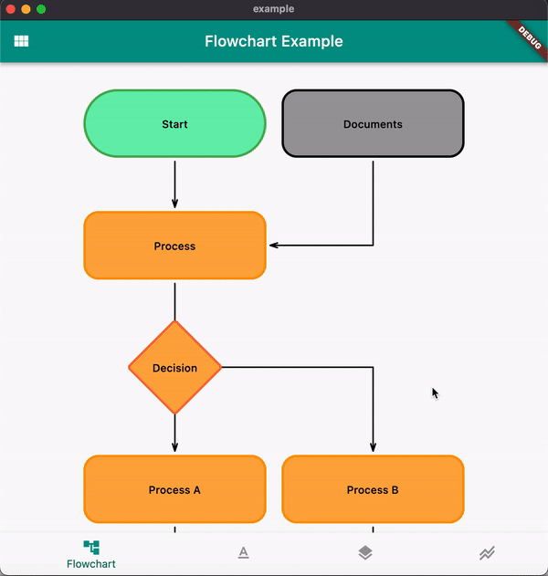
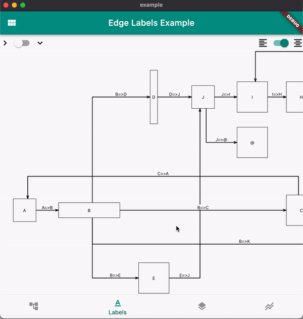
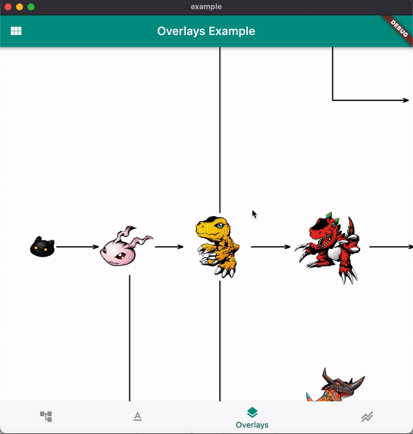

# Graphite

[](https://github.com/lempiy/flutter_graphite/actions)
[](https://pub.dev/packages/graphite)
[](https://github.com/lempiy/flutter_graphite)
[](https://github.com/lempiy/flutter_graphite)
[](https://github.com/lempiy/flutter_graphite)
[](https://github.com/lempiy/flutter_graphite)


:arrow_right: :black_square_button: Flutter widget to draw direct graphs, trees, flowcharts in rectanglar manner.

#### Support the author :yellow_heart: :blue_heart:


[](https://savelife.in.ua/en/donate-en/#donate-army-card-once)


The only reason why the latest release of Graphite become possible is because of __Armed Forces Of Ukraine__.
Ukrainian defenders are those who saved the author's life last spring and currently continue fighting 
with absolute evil in my country. If you liked this lib and want to support future releases I would 
be grateful for your donations to [Come Back Alive](https://savelife.in.ua/en/donate-en/#donate-army-card-once) Charity which directly supports UA Army with equipment. 

Thank you.


  











## Example of usage:
```dart
import 'package:flutter/material.dart';
import 'package:graphite/graphite.dart';

void main() => runApp(MyApp());
const list = '['
    '{"id":"A","next":[{"outcome":"B"}]},'
    '{"id":"B","next":[{"outcome":"C"},{"outcome":"D"},{"outcome":"E"}]},'
    '{"id":"C","next":[{"outcome":"F"}]},'
    '{"id":"D","next":[{"outcome":"J"}]},{"id":"E","next":[{"outcome":"J"}]},'
    '{"id":"J","next":[{"outcome":"I"}]},'
    '{"id":"I","next":[{"outcome":"H"}]},{"id":"F","next":[{"outcome":"K"}]},'
    '{"id":"K","next":[{"outcome":"L"}]},'
    '{"id":"H","next":[{"outcome":"L"}]},{"id":"L","next":[{"outcome":"P"}]},'
    '{"id":"P","next":[{"outcome":"M"},{"outcome":"N"}]},'
    '{"id":"M","next":[]},{"id":"N","next":[]}'
    ']';

class MyApp extends StatelessWidget {
  @override
  Widget build(BuildContext context) {
    return MaterialApp(
      title: 'Flutter Graphite',
      theme: ThemeData(
        primarySwatch: Colors.teal,
      ),
      home: MyHomePage(),
    );
  }
}

class MyHomePage extends StatefulWidget {
  MyHomePage({Key key}) : super(key: key);
  @override
  _MyHomePageState createState() => _MyHomePageState();
}

class _MyHomePageState extends State<MyHomePage> {
  @override
  Widget build(BuildContext context) {
    return Scaffold(
      body: DirectGraph(
        list: nodeInputFromJson(list),
        defaultCellSize: const Size(100.0, 100.0),
        cellPadding: const EdgeInsets.all(20),
        orientation: MatrixOrientation.Vertical,
      ),
    );
  }
}
```

## Features
* Nodes and edge gesture events.
* Ability provide graph building direction (horizontal or vertical).
* Ability to scale & pan graph through Interactive Widget.
* Ability to provide custom builder to node widget.
* Ability to add overlays.
* Ability to add edge text or `Widget` labels.
* Ability to provide custom paint builder to graph edges.
* Ability to customize arrows.


## License

MIT © [lempiy](https://github.com/lempiy)
