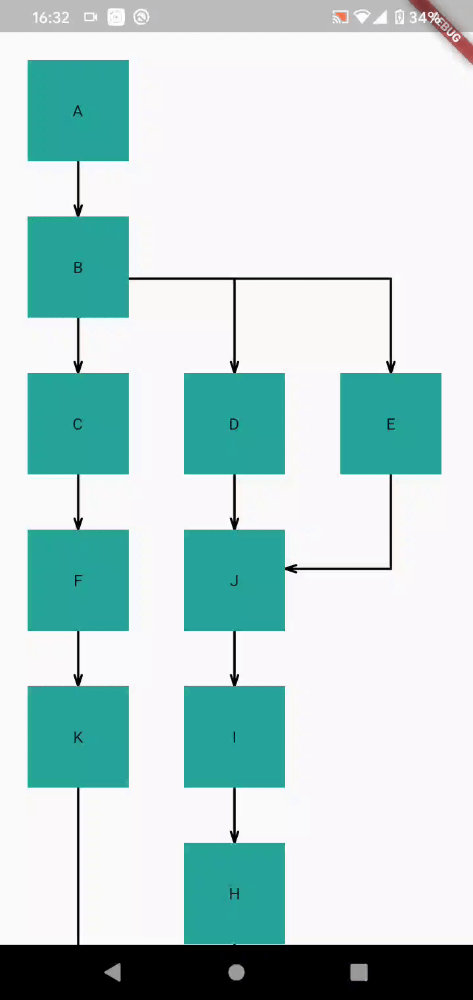
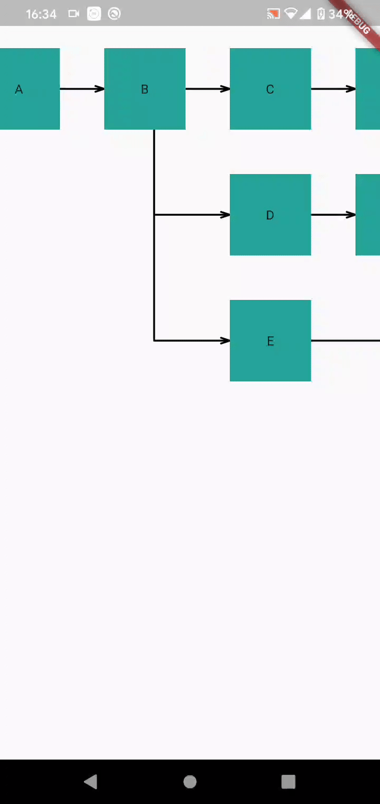
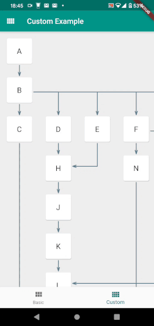

# Graphite


[](https://pub.dev/packages/graphite)
[](https://github.com/lempiy/flutter_graphite)
[](https://github.com/lempiy/flutter_graphite)
[](https://github.com/lempiy/flutter_graphite)
[](https://github.com/lempiy/flutter_graphite)


:arrow_right: :black_square_button: Flutter widget to draw direct graphs, trees, flowcharts in rectanglar manner.


    


## Example of usage:
```dart
import 'package:flutter/material.dart';
import 'package:graphite/core/matrix.dart';
import 'package:graphite/core/typings.dart';
import 'package:graphite/graphite.dart';

void main() => runApp(MyApp());
const presetBasic =
    '[{"id":"A","next":["B"]},{"id":"B","next":["C","D","E"]},'
    '{"id":"C","next":["F"]},{"id":"D","next":["J"]},{"id":"E","next":["J"]},'
    '{"id":"J","next":["I"]},{"id":"I","next":["H"]},{"id":"F","next":["K"]},'
    '{"id":"K","next":["L"]},{"id":"H","next":["L"]},{"id":"L","next":["P"]},'
    '{"id":"P","next":["M","N"]},{"id":"M","next":[]},{"id":"N","next":[]}]';

class MyApp extends StatelessWidget {
  @override
  Widget build(BuildContext context) {
    return MaterialApp(
      title: 'Flutter Graphite',
      theme: ThemeData(
        primarySwatch: Colors.teal,
      ),
      home: MyHomePage(),
    );
  }
}

class MyHomePage extends StatefulWidget {
  MyHomePage({Key key}) : super(key: key);
  @override
  _MyHomePageState createState() => _MyHomePageState();
}

class _MyHomePageState extends State<MyHomePage> {
  @override
  Widget build(BuildContext context) {
    var list = nodeInputFromJson(presetBasic);
    return Scaffold(
      body: DirectGraph(
        list: list,
        cellWidth: 136.0,
        cellPadding: 24.0,
        orientation: MatrixOrientation.Vertical,
      ),
    );
  }
}
```

## Features
* Nodes and edge gesture events.
* Ability provide graph building direction (horizontal or vertical).
* Ability provide scrolling direction (horizontal, vertical, both or none).
* Ability to provide custom builder to node widget.
* Ability to provide custom paint builder to graph edges.
* Ability to customize arrows.


## License

MIT © [lempiy](https://github.com/lempiy)
